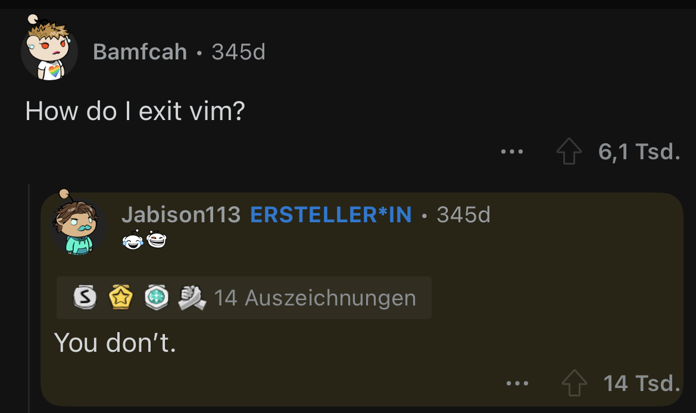

<!----------- TOP ----------->
```console
casudo@github:~$ cat README.md
```


 &nbsp;

<!----------- MIDDLE ----------->
<p align="center">
    
    
    
    <br>
    
</p>

<!-- About Me -->
<h2 align="center">About Me</h2>

👀 IT enthusiast and self-taught hobby developer  
🤖 Full-time Network Engineer  
💻 Selfhosted nearly every cloud alternative  
🤝 Looking forward to new challenges and opportunities in the ever-evolving IT landscape.  
🌟 Passionate about technology and constantly expanding my skills in the IT world.  

🚀 Let's connect and explore how we can collaborate!  
✉️ Reach me at contact (æt) k1da (døt) de  

<div align="center">
  <!-- Skills -->
  <h2>Currently Using</h2>
   
  <br> 
  <h2>Used In The Past</h2>
  
  <h2>Planned to learn</h2>
  

  <!-- Statistics -->
  <h2>My Stats</h2>
  
  <br><br>
  

  <!-- Just for fun -->
  <h2>Giggles</h2>
  
</div>

<!----------- BOTTOM ----------->


<!-- Socials -->
<div align="center">
  <h2>My Socials</h2>  

  <a href="https://k1da.de">
    
  </a> &nbsp;

  <a href="mailto:contact@k1da.de">
     
  </a> &nbsp;

  <a href="https://github.com/casudo">
    
  </a>

  <a href="https://hub.docker.com/r/casudo1/vcard">
    
  </a>
</div>

<br><br><br><br>

